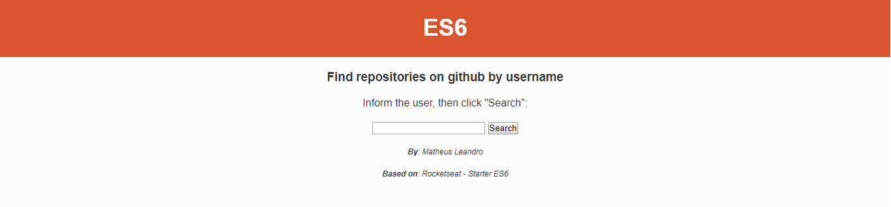
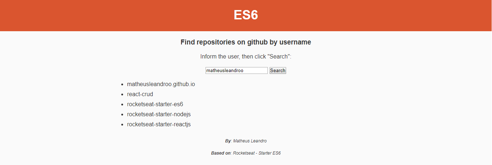

# ES6

A simple project based on Rocketseat Starter ES6.

<h3>Getting Started</h3>

After clone repository, open the file "**index.html**":

Then, inform the username and click in "Search":

<h3>Built With</h3>

<ul>
  <li>ES6</li>
  <li>HTML</li>
  <li>CSS</li>
</ul>

<h3>Authors</h3>

<ul>
  <li>Matheus Leandro</li>
</ul>

<h3>License</h3>

This project is licensed under the MIT License - see the LICENSE.md file for details

Enjoy ;)
